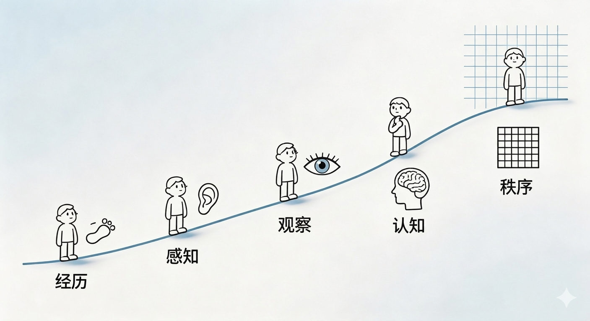

# Telos

**τέλος**

 

*记录生命，沉淀认知，建立秩序*

**Become who you are meant to be.**

 

[English](docs/README_EN.md) · [开发文档](docs/DEVELOPMENT.md)

 

 
 

---

## 起源

在复杂、孤独而短暂的人生中，我们经历着无数瞬间——

有些充满力量，有些脆弱不堪；  
有些清晰明确，有些混沌迷茫。

 

我们努力工作、学习、健身、社交，试图让生活变得更好。

但很多时候，我们只是在**应对**，而不是在**理解**。

 

**Telos** (τέλος) 是我为自己创造的一个私人 Agent。

它不是效率工具，不是健康记录器，不是时间管理软件。

它是一个**长期系统**——记录我的生命，理解我的状态，承接我对世界的观察与感悟，沉淀我的认知，帮助我在这个世界中，慢慢建立属于自己的秩序。

 

它追求的是：

- **记录**生命的真实轨迹
- **理解**自我的内在状态  
- **观察**世界的变化与规律
- **沉淀**认知的结构与原则
- **建立**属于自己的秩序

 

---

## 五层生命框架

Telos 理解的"生命"，不是单一维度的功能分类，而是一个从经历到秩序的完整结构：

 

 

**经历 → 感知 → 观察 → 认知 → 秩序**

 

从最底层的自我经历出发，经过日常生活的感知，到对世界的观察，再到认知的沉淀，最终形成长期稳定的内在秩序。

每一层都不是孤立的功能模块，而是生命自然流动的一个切面。

 

---

## 为什么只为自己而做

> *"我"本身就是最复杂、最长期、也最值得被理解的对象。*

 

每天，我们的习惯、喜好、需求、社交，都在被大数据悄悄记住。算法比我们自己更知道我们会点开什么、买下什么、沉迷什么——但它记住这些，是为了收割。

我们也记录，但目的完全不同——**不为商业，不为算法，只为认识自己。**

 

我的生命不是一个标准化需求集合。很多真正重要的问题——关于孤独、恐惧、意志、方向——无法被通用产品抽象成标准功能。

这里记录的不只是任务和数据，还有脆弱的、私密的、真实的生命材料。只有自己掌控，系统才能真正承接这些东西。

 

---

 

**协作者**

 
 

**Telos** — *Become who you are meant to be.*

 

*MIT License*  
*这个项目是为我自己而做，但如果对你有启发，欢迎参考和借鉴。*

