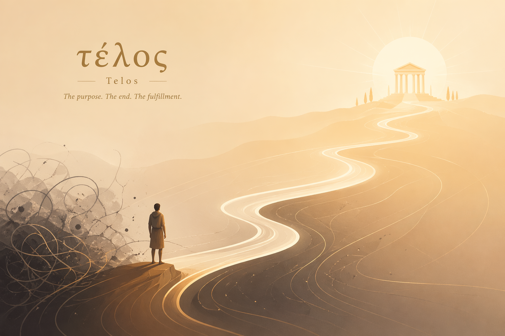

<div align="center">

# Telos

**τέλος**

<br>

*记录生命，沉淀认知，建立秩序*

**Become who you are meant to be.**

<br>



</div>

<br>
<br>

---

## 起源

在复杂、孤独而短暂的人生中，我们经历着无数瞬间——

有些充满力量，有些脆弱不堪；  
有些清晰明确，有些混沌迷茫。

<br>

我们努力工作、学习、健身、社交，试图让生活变得更好。

但很多时候，我们只是在**应对**，而不是在**理解**。

<br>

**Telos** (τέλος) 是我为自己创造的一个私人 Agent。

它不是效率工具，不是健康记录器，不是时间管理软件。

它是一个**长期系统**——记录我的生命，理解我的状态，承接我对世界的观察与感悟，沉淀我的认知，帮助我在这个世界中，慢慢建立属于自己的秩序。

<br>

<div align="center">

</div>

<br>

---

## 这不是一个效率工具

Telos 不追求让你"做更多事"。

<br>

它追求的是：

- **记录**生命的真实轨迹
- **理解**自我的内在状态  
- **观察**世界的变化与规律
- **沉淀**认知的结构与原则
- **建立**属于自己的秩序

<br>

---

## 五层生命框架

Telos 理解的"生命"，不是单一维度的功能分类，而是一个从经历到秩序的完整结构：

<br>

<div align="center">

```
                    ┌─────────────┐
                    │    秩序     │  节律 · 原则 · 框架 · 方向
                    │   Order     │
                    ├─────────────┤
                    │    认知     │  反思 · 模型 · 信念 · 原则
                    │  Cognition  │
                    ├─────────────┤
                    │    世界     │  观察 · 关系 · 现实 · 规律
                    │   World     │
                    ├─────────────┤
                    │    生活     │  健康 · 学习 · 工作 · 习惯
                    │    Life     │
                    ├─────────────┤
                    │    自我     │  爱 · 孤独 · 勇敢 · 意志
                    │    Self     │
                    └─────────────┘
```

<br>

**经历 → 感知 → 观察 → 认知 → 秩序**

</div>

<br>

从最底层的自我经历出发，经过日常生活的感知，到对世界的观察，再到认知的沉淀，最终形成长期稳定的内在秩序。

每一层都不是孤立的功能模块，而是生命自然流动的一个切面。

<br>

---

## 为什么只为自己而做

> *"我"本身就是最复杂、最长期、也最值得被理解的对象。*

<br>

我的生命不是一个标准化需求集合。很多真正重要的问题——关于孤独、恐惧、意志、方向——无法被通用产品抽象成标准功能。

这里记录的不只是任务和数据，还有脆弱的、私密的、真实的生命材料。只有自己掌控，系统才能真正承接这些东西。

<br>

Telos 的价值不在单次使用，而在长期积累。数据越完整，它越能理解我的节律、模式与成长轨迹。它不是一次性交付的工具，而是一个长期共生的系统。

而我自己，就是最直接的验证场——我能第一时间感受到，这个系统是否真的懂我。

<br>

<div align="center">

</div>

<br>

---

## 成功的唯一标准

这个系统的成功，不用用户数、活跃度或商业指标来衡量。

<br>

<div align="center">

它的成功标准只有一个：

<br>

> ### 我是否每天都在用
> 
> ### 是否觉得离不开
> 
> ### 是否真的帮助我成为了更好的自己

<br>
<br>

</div>

---

<br>

<div align="center">

**Telos** — *Become who you are meant to be.*

<br>
<br>

*MIT License*  
*这个项目是为我自己而做，但如果对你有启发，欢迎参考和借鉴。*

</div>
